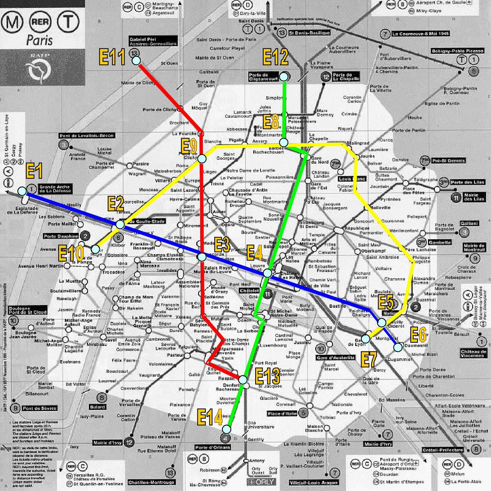

# 🚇 Paris Metro A* Route Planner

> Um sistema inteligente de planejamento de rotas para o Metrô de Paris usando o algoritmo A* (A-estrela)

[](https://www.rust-lang.org/)
[](https://opensource.org/licenses/MIT)



## 📋 Sobre o Projeto

Este projeto foi desenvolvido como parte da disciplina de **Estrutura de Dados II** com foco em **Algoritmos em Grafos**. O sistema auxilia usuários do metrô de Paris a encontrar o trajeto mais rápido entre estações, utilizando o algoritmo A* para busca informada em grafos.

### 🎯 Características Principais

- **Interface Gráfica Interativa**: Desenvolvida com egui/eframe
- **Algoritmo A* Otimizado**: Implementação eficiente para busca de caminhos
- **4 Linhas de Metrô**: Azul, Amarela, Vermelha e Verde
- **Cálculo de Tempo Real**: Considera velocidade dos trens (30km/h) e tempo de baldeação (4min)
- **Visualização do Trajeto**: Mostra graficamente o melhor caminho

## 🧮 Funcionamento do Algoritmo A*

O algoritmo A* funciona da seguinte forma:

1. **Inicialização**: Coloca a estação origem na lista aberta com f = 0
2. **Seleção**: Escolhe o nó com menor valor f (f = g + h) da lista aberta
3. **Expansão**: Explora todos os vizinhos do nó atual, calculando seus custos
4. **Avaliação**: Para cada vizinho, calcula g (tempo real) + h (tempo estimado)
5. **Finalização**: Repete até encontrar a estação destino ou esgotar possibilidades

Onde:
- **g**: Tempo estimado entre a estação de origem e a estação atual
- **h**: Tempo heurístico entre a estação atual e a estação de destino
- **f**: Função de avaliação total (f = g + h)

## 🗺️ Estrutura do Metrô

### Linhas Disponíveis
- 🔵 **Linha Azul** (cor=1): Estações 1, 2, 3, 4, 5, 6
- 🟡 **Linha Amarela** (cor=2): Estações 2, 5, 7, 8, 9, 10
- 🔴 **Linha Vermelha** (cor=3): Estações 3, 9, 11, 13
- 🟢 **Linha Verde** (cor=4): Estações 4, 8, 12, 13, 14

### Exemplo de Busca
**Caso de Teste**: E6 (Linha Azul) → E13 (Linha Vermelha)
- Estação Inicial: E6 (Linha Azul)
- Estação Final: E13 (Linha Vermelha)
- Requer baldeação entre linhas

## 🚀 Como Executar

> **🎯 IMPORTANTE**: O objetivo principal é rodar o projeto na sua própria máquina usando `cargo run --release`. 
> Gerar executável independente é apenas um extra opcional. O diretório `target/` (que contém os binários) 
> é muito grande e **não é incluído no repositório Git**.

### 📋 Pré-requisitos

Antes de executar o projeto, certifique-se de ter os seguintes itens instalados:

#### 1. **Rust Toolchain (Obrigatório)**
```bash
# Instalar Rust via rustup (método recomendado)
curl --proto '=https' --tlsv1.2 -sSf https://sh.rustup.rs | sh

# Seguir as instruções na tela e reiniciar o terminal
source ~/.cargo/env

# Verificar a instalação
rustc --version
cargo --version

# Atualizar para a versão mais recente (se necessário)
rustup update
```

**No Windows:**
1. Baixe e execute o instalador do [rustup.rs](https://rustup.rs/)
2. Siga as instruções do instalador
3. Reinicie o prompt de comando

#### 2. **Dependências do Sistema para Interface Gráfica**

**Linux (Ubuntu/Debian):**
```bash
# Dependências básicas para compilação
sudo apt update
sudo apt install build-essential pkg-config libfontconfig1-dev

# Dependências específicas para egui/OpenGL
sudo apt install libxcb-render0-dev libxcb-shape0-dev libxcb-xfixes0-dev \
    libxkbcommon-dev libssl-dev

# Para suporte completo a fontes
sudo apt install fonts-dejavu fonts-liberation
```

**Linux (Fedora/CentOS/RHEL):**
```bash
# Dependências básicas
sudo dnf groupinstall "Development Tools"
sudo dnf install pkg-config fontconfig-devel openssl-devel

# Dependências para interface gráfica
sudo dnf install libxkbcommon-devel libX11-devel
```

**Linux (Arch/Manjaro):**
```bash
# Instalar dependências
sudo pacman -S base-devel pkg-config fontconfig

# Para interface gráfica
sudo pacman -S libxkbcommon libx11
```

**macOS:**
```bash
# Instalar Xcode command line tools (se ainda não tiver)
xcode-select --install

# Se usar Homebrew, instalar pkg-config
brew install pkg-config
```

**Windows:**
- **Visual Studio Build Tools 2019 ou mais recente** (recomendado)
- Ou **Visual Studio Community** com desenvolvimento em C++
- Alternativamente: **MSYS2/MinGW-w64**

#### 3. **Verificação de Drivers Gráficos**
O projeto usa OpenGL para renderização. Certifique-se de que:
- Os drivers gráficos estão atualizados
- OpenGL 3.0+ está disponível (a maioria dos sistemas modernos suporta)

### 🔧 Instalação e Execução

#### 🎯 Método Principal: Executar com Cargo (Recomendado)
```bash
# Clone o repositório
git clone https://github.com/seu-usuario/rust-paris-transit-a-star.git

# Entre no diretório do projeto
cd rust-paris-transit-a-star

# Execute diretamente (primeira vez pode demorar alguns minutos)
cargo run --release
```

> **💡 Dica**: Use sempre `cargo run --release` para melhor performance. O Cargo compila e executa automaticamente!

#### 📦 Download Manual
1. Baixe o arquivo ZIP do repositório no GitHub
2. Extraia para uma pasta de sua escolha
3. Abra o terminal/prompt na pasta extraída
4. Execute `cargo run --release`

#### 🔍 Verificação do Projeto
```bash
# Verificar se o projeto compila sem erros
cargo check

# Ver possíveis warnings de código
cargo clippy

# Formatar código (se você for contribuir)
cargo fmt
```

### 🏗️ Compilação de Executável (Opcional)

> **⚠️ Nota**: Gerar executável é opcional! O mais importante é rodar `cargo run --release` na sua máquina.

```bash
# Compilar versão otimizada (apenas se quiser um executável independente)
cargo build --release

# O executável ficará em:
# Linux/macOS: ./target/release/metro_paris_astar
# Windows: .\target\release\metro_paris_astar.exe

# Executar o binário compilado (opcional)
./target/release/metro_paris_astar  # Linux/macOS
.\target\release\metro_paris_astar.exe  # Windows
```

**📂 Importante sobre o diretório `target/`:**
- Contém arquivos de compilação (pode chegar a centenas de MB)
- **NÃO é incluído no repositório** Git (está no `.gitignore`)
- É recriado automaticamente quando você executa `cargo run` ou `cargo build`
- Pode ser deletado a qualquer momento para economizar espaço

### 🐛 Solução de Problemas Comuns

> **🎯 Lembre-se**: O objetivo é rodar `cargo run --release` na sua máquina. Não se preocupe em gerar executáveis!

#### **Problemas de Compilação no Linux:**
```bash
# Erro: "failed to find tool. Is `pkg-config` installed?"
sudo apt install pkg-config

# Erro de fontes ou fontconfig
sudo apt install libfontconfig1-dev fontconfig

# Erro de OpenGL/X11
sudo apt install libgl1-mesa-dev libxrandr-dev libxcursor-dev libxi-dev
```

#### **Problemas no Windows:**
- **Erro de linker**: Instalar Visual Studio Build Tools
- **Dependências ausentes**: Usar o instalador completo do Visual Studio
- **Erro de OpenGL**: Atualizar drivers gráficos

#### **Problemas no macOS:**
```bash
# Se tiver problemas com Xcode tools
sudo xcode-select --reset
xcode-select --install
```

#### **Performance e Execução:**
- **Primeira compilação lenta**: Normal, dependências são baixadas e compiladas (5-10 min)
- **Execução lenta**: Sempre use `cargo run --release` para melhor performance
- **Interface não abre**: Verificar se OpenGL está disponível
- **Travamentos**: Testar com `cargo run --release` ao invés de `cargo run`

#### **Problemas com Dependências:**
```bash
# Limpar cache do Cargo e recompilar (solução universal)
cargo clean
cargo run --release

# Atualizar dependências se necessário
cargo update

# Se o diretório target/ estiver corrompido, delete-o
rm -rf target/  # Linux/macOS
rmdir /s target  # Windows
cargo run --release  # Será recriado automaticamente
```

#### **Verificação de Sistema:**
```bash
# Verificar versão do Rust (mínimo: 1.70)
rustc --version

# Verificar se o Cargo funciona
cargo --version

# Testar compilação básica (sem executar)
cargo check

# Ver tamanho do projeto (target/ pode ser grande!)
du -sh target/  # Linux/macOS
dir target  # Windows
```

#### **🔧 Comandos Úteis para Desenvolvimento:**
```bash
# Executar normalmente
cargo run --release

# Apenas compilar (mais rápido para testar se há erros)
cargo check

# Ver warnings e sugestões de melhoria
cargo clippy

# Formatar código automaticamente
cargo fmt

# Limpar tudo e economizar espaço
cargo clean
```

## � Requisitos Mínimos de Sistema

### 🖥️ Hardware
- **RAM**: 2GB mínimo (4GB recomendado)
- **Espaço em Disco**: 500MB para projeto + dependências compiladas
- **Processador**: Qualquer CPU x64 dos últimos 10 anos
- **Placa Gráfica**: Suporte a OpenGL 3.0+ (integrada serve)

### 🖧 Software
- **Rust**: 1.70.0 ou superior (edition 2024)
- **Sistema Operacional**: 
  - Linux (Ubuntu 18.04+, Fedora 30+, Arch Linux)
  - macOS 10.12+ (Sierra ou mais recente)
  - Windows 10+ (64-bit)

### 🔧 Dependências de Runtime
- OpenGL 3.0+ (disponível na maioria dos sistemas)
- Fontes do sistema (TrueType/OpenType)
- Acesso à rede (apenas para download inicial das dependências)

## 🏗️ Arquitetura do Projeto

### 📁 Estrutura de Diretórios
```
rust-paris-transit-a-star/
├── 📄 Cargo.toml                      # Configuração do projeto e dependências
├── 📄 Cargo.lock                      # Lock das versões das dependências
├── 📄 README.md                       # Documentação principal
├── 📄 LICENSE                         # Licença MIT
├── 🖼️ mapa.jpg                        # Imagem ilustrativa do metrô
├── 📁 src/                           # Código fonte principal
│   ├── 📄 main.rs                    # → Ponto de entrada da aplicação
│   ├── 📄 algoritmo_a_estrela.rs     # → Implementação completa do A*
│   ├── 📄 dados_metro.rs             # → Carregamento e parsing dos CSVs
│   ├── 📄 grafo_metro.rs             # → Estrutura do grafo e conexões
│   └── 📁 egui/                      # → Módulos da interface gráfica
│       ├── 📄 mod.rs                 # → Declarações públicas dos módulos
│       ├── 📄 app.rs                 # → Estrutura principal da aplicação
│       ├── 📄 controls.rs            # → Painel lateral de controles
│       ├── 📄 drawing.rs             # → Renderização do grafo visual
│       ├── 📄 navigation.rs          # → Zoom, arrastar, interações
│       ├── 📄 popups.rs              # → Tooltips e janelas informativas
│       ├── 📄 state_manager.rs       # → Estado do algoritmo A*
│       └── 📄 visual_effects.rs      # → Marcadores e efeitos visuais
├── 📁 data/                          # Dados do sistema de metrô
│   ├── 📄 tabela1_distancias_diretas.csv    # → Heurística (linha reta)
│   ├── 📄 tabela2_distancias_reais.csv      # → Distâncias das conexões
│   └── 📄 tabela_linhas_conexao.csv         # → Matriz de conectividade
└── 📁 target/ 🚫                     # Binários compilados (NÃO no Git)
    ├── 📁 debug/                     # → Builds de desenvolvimento
    └── 📁 release/                   # → Builds otimizados
```

**🚫 Arquivos NÃO incluídos no repositório Git:**
- `target/` - Diretório de compilação (pode ter centenas de MB)
- `Cargo.lock` - Em alguns casos (para bibliotecas)
- Arquivos temporários e de cache

**✅ Como o Git está configurado:**
```gitignore
# Rust
/target/
**/*.rs.bk
Cargo.lock  # Para alguns projetos

# IDE
.vscode/
.idea/
*.swp
*.swo

# Sistema
.DS_Store
Thumbs.db
```

### 🧩 Módulos e Responsabilidades

#### **Core do Sistema**
- **`main.rs`**: Inicialização da aplicação egui e loop principal
- **`algoritmo_a_estrela.rs`**: Lógica completa do algoritmo A* com heap binária
- **`grafo_metro.rs`**: Estrutura de dados do grafo, nós e conexões
- **`dados_metro.rs`**: Leitura dos CSVs e construção das estruturas de dados

#### **Interface Gráfica (egui/)**
- **`app.rs`**: Estrutura principal (`MetroApp`) e loop de renderização
- **`controls.rs`**: Painel lateral com dropdowns, botões e configurações
- **`drawing.rs`**: Renderização das estações, linhas e caminhos no canvas
- **`navigation.rs`**: Controles de zoom, arrastar e transformações de coordenadas
- **`popups.rs`**: Janelas modais com informações detalhadas das estações
- **`state_manager.rs`**: Gerenciamento de estado do algoritmo (executando, pausado, etc.)
- **`visual_effects.rs`**: Marcadores visuais, cores e animações

### 🔄 Fluxo de Dados

```
┌─ Início da Aplicação ─┐
│                       │
▼                       │
📄 main.rs              │
├── Inicializa eframe   │
├── Carrega dados CSV   │
└── Cria MetroApp       │
                        │
▼                       │
🎮 Interface Gráfica    │
├── Renderiza mapa      │
├── Processa eventos    │
└── Atualiza estado     │
                        │
▼                       │
🧮 Algoritmo A*         │
├── Recebe origem/dest  │
├── Executa busca       │
├── Retorna caminho     │
└── Atualiza visual     │
                        │
▼                       │
📊 Exibição Resultado   │
├── Caminho ótimo       │
├── Tempo total         │
└── Estatísticas        └─┘
```

## �📊 Dados do Sistema

### Tabelas de Distâncias

O sistema utiliza duas tabelas principais:

1. **Tabela 1 - Distâncias Diretas**: Distâncias em linha reta entre estações
2. **Tabela 2 - Distâncias Reais**: Distâncias reais das conexões existentes

### Tabela de Conexões

```
Matriz 14x14 representando as conexões entre estações:
- 0: Sem conexão
- 1: Linha Azul
- 2: Linha Amarela  
- 3: Linha Vermelha
- 4: Linha Verde
```

## 🏗️ Arquitetura do Projeto

```
src/
├── main.rs                    # Ponto de entrada da aplicação
├── algoritmo_a_estrela.rs     # Implementação do algoritmo A*
├── dados_metro.rs             # Carregamento dos dados CSV
├── grafo_metro.rs             # Estrutura do grafo do metrô
└── egui/                      # Módulos da interface gráfica
    ├── mod.rs                 # Declaração dos módulos
    ├── app.rs                 # Estrutura principal da aplicação
    ├── controls.rs            # Painel de controles lateral
    ├── drawing.rs             # Renderização do grafo e estações
    ├── navigation.rs          # Controles de navegação (zoom, arrastar)
    ├── popups.rs              # Popups informativos das estações
    ├── state_manager.rs       # Gerenciamento de estado do algoritmo
    └── visual_effects.rs      # Efeitos visuais e marcadores

data/
├── tabela1_distancias_diretas.csv    # Distâncias heurísticas (linha reta)
├── tabela2_distancias_reais.csv      # Distâncias reais das conexões
└── tabela_linhas_conexao.csv         # Matriz de conexões por linha
```

## 🛠️ Tecnologias e Dependências

### 🦀 Rust Ecosystem
- **[Rust](https://www.rust-lang.org/)** `1.70+`: Linguagem de programação principal
- **[Cargo](https://doc.rust-lang.org/cargo/)**: Sistema de build e gerenciador de dependências

### 🖼️ Interface Gráfica
- **[egui](https://github.com/emilk/egui)** `0.31.1`: Framework para interface gráfica imediata
- **[eframe](https://github.com/emilk/egui/tree/master/crates/eframe)** `0.31.1`: Framework de aplicação para egui
- **[emath](https://docs.rs/emath/)**: Matemática 2D para egui

### 📊 Processamento de Dados
- **[csv](https://docs.rs/csv/)** `1.3.1`: Biblioteca para leitura de arquivos CSV

### 🏗️ Estruturas de Dados
- **[std::collections](https://doc.rust-lang.org/std/collections/)**: HashMap, HashSet, BinaryHeap para estruturas de dados eficientes
- **[std::rc::Rc](https://doc.rust-lang.org/std/rc/struct.Rc.html)**: Compartilhamento de referências para o grafo

### 📦 Dependências Automáticas
Todas as dependências são gerenciadas automaticamente pelo Cargo através do arquivo `Cargo.toml`:

```toml
[package]
name = "metro_paris_astar"
version = "0.1.0"
edition = "2024"

[dependencies]
csv = "1.3.1"       # Para ler arquivos CSV
eframe = "0.31.1"   # Para a interface gráfica com egui (framework)
egui = "0.31.1"     # Biblioteca de interface gráfica imediata

# Para Windows: compilação estática
[target.x86_64-pc-windows-gnu.dependencies]
winapi = { version = "0.3", features = ["everything"] }
```

## 🎮 Como Usar a Interface

### 🚀 Iniciando o Programa
1. Execute `cargo run --release` no terminal
2. Aguarde a interface gráfica carregar
3. Você verá o mapa do metrô com todas as estações e linhas

### 🎯 Planejando uma Rota
1. **Selecionar Origem**: Use o dropdown "Estação de Origem" no painel lateral
2. **Selecionar Destino**: Use o dropdown "Estação de Destino" no painel lateral
3. **Iniciar Busca**: Clique no botão "Iniciar A*" para começar o algoritmo
4. **Visualizar Resultado**: O melhor caminho será destacado em verde

### 🔍 Navegação no Mapa
- **Zoom**: Use a roda do mouse para aproximar/afastar
- **Arrastar**: Clique e arraste com o botão esquerdo para mover o mapa
- **Reset de Zoom**: Use o slider de zoom no painel de controles
- **Informações da Estação**: Clique em qualquer estação para ver detalhes

### ⚙️ Controles Avançados
- **Execução Passo a Passo**: Use "Próximo Passo" para ver o algoritmo funcionar
- **Executar Tudo**: Processa o algoritmo completo de uma vez
- **Limpar Tudo**: Remove todos os caminhos e marcadores visuais
- **Mostrar Tempos**: Toggle para exibir tempos nas conexões
- **Mostrar IDs**: Toggle para exibir identificadores das estações

### 📊 Interpretando os Resultados
- **Linha Verde**: Caminho ótimo encontrado pelo A*
- **Círculos Coloridos**: Status das estações durante a busca
- **Tempo Total**: Exibido no painel de resultados
- **Número de Baldeações**: Quantas trocas de linha são necessárias

## 📈 Funcionalidades da Interface

### 🎮 Controles Principais
- ✅ **Seleção de Estações**: ComboBox para escolher origem e destino
- ✅ **Busca A***: Botão para iniciar/reiniciar a busca do melhor caminho
- ✅ **Execução Passo a Passo**: Navegar pelos passos do algoritmo
- ✅ **Executar Tudo**: Executar o algoritmo completo de uma vez
- ✅ **Limpar Tudo**: Resetar o estado visual

### 🎯 Navegação e Visualização
- ✅ **Zoom**: Use a roda do mouse para aproximar/afastar
- ✅ **Arrastar**: Clique e arraste para mover a visualização
- ✅ **Popups Informativos**: Clique nas estações para ver detalhes
- ✅ **Marcadores Visuais**: Status das estações (início, fim, explorando, etc.)

### 📊 Opções de Exibição
- ✅ **Mostrar Tempos**: Exibir tempo de viagem nas conexões
- ✅ **Mostrar Status**: Marcadores visuais do estado das estações
- ✅ **Mostrar IDs**: Identificadores das estações (E1, E2, etc.)
- ✅ **Controle de Zoom**: Slider para ajustar o nível de zoom

### 🔍 Informações Detalhadas
- ✅ **Resumo da Rota**: Tempo total, número de baldeações
- ✅ **Trajeto Completo**: Lista de estações e linhas do percurso
- ✅ **Análise do A***: Valores f, g, h de cada estação sendo analisada
- ✅ **Status em Tempo Real**: Mensagens sobre o progresso da busca

## 🔧 Parâmetros do Sistema

- **Velocidade média dos trens**: 30 km/h
- **Tempo de baldeação**: 4 minutos
- **Total de estações**: 14
- **Total de linhas**: 4

## 📚 Estrutura de Dados

O projeto utiliza as seguintes estruturas principais:

- **Grafo**: Representação das estações e conexões
- **Nó A***: Estrutura para o algoritmo com valores f, g, h
- **Heap Binária**: Para otimizar a seleção do próximo nó
- **HashMap**: Para acesso rápido às estações

## 🤝 Contribuição

Contribuições são muito bem-vindas! Este é um projeto educacional em constante evolução.

### 🔧 Para Desenvolvedores

#### Configuração do Ambiente de Desenvolvimento
```bash
# Clone o repositório
git clone https://github.com/seu-usuario/rust-paris-transit-a-star.git
cd rust-paris-transit-a-star

# Instale ferramentas de desenvolvimento do Rust
rustup component add rustfmt rust-analyzer clippy

# Execute os testes (se houver)
cargo test

# Verifique o código
cargo clippy

# Formate o código
cargo fmt
```

#### Como Contribuir
1. **Fork** do projeto no GitHub
2. **Clone** seu fork: `git clone https://github.com/SEU-USUARIO/rust-paris-transit-a-star.git`
3. **Crie uma branch** para sua feature: `git checkout -b feature/MinhaFeature`
4. **Implemente** suas mudanças seguindo as convenções do projeto
5. **Teste** suas mudanças: `cargo test && cargo run --release`
6. **Commit** suas mudanças: `git commit -m 'Adiciona MinhaFeature'`
7. **Push** para sua branch: `git push origin feature/MinhaFeature`
8. **Abra um Pull Request** explicando suas mudanças

### � Ideias para Contribuições
- ✨ Adicionar mais estações e linhas do metrô real de Paris
- 🎨 Melhorar a interface visual e animações
- 📊 Implementar outros algoritmos de busca (Dijkstra, BFS, DFS)
- 🔧 Adicionar testes automatizados
- 📱 Criar versão para mobile/web com egui
- 🌐 Internacionalização (i18n) para múltiplos idiomas
- 📈 Adicionar métricas de performance do algoritmo
- 🗺️ Integração com dados reais da RATP (metrô de Paris)

### 📝 Padrões de Código
- Use `cargo fmt` antes de cada commit
- Execute `cargo clippy` para verificar boas práticas
- Mantenha comentários em português para consistência
- Siga as convenções de nomenclatura do Rust

## 🆘 Suporte e Dúvidas

### 📞 Onde Buscar Ajuda
- **Issues do GitHub**: Para bugs e solicitações de features
- **Discussions**: Para dúvidas gerais sobre o projeto
- **Rust Community**: [Forum oficial do Rust](https://users.rust-lang.org/)

### � Reportando Bugs
Ao reportar um bug, inclua:
1. **Sistema operacional** e versão
2. **Versão do Rust** (`rustc --version`)
3. **Passos para reproduzir** o problema
4. **Mensagens de erro** completas
5. **Screenshots** se relevante

### 💬 Perguntas Frequentes

**P: O programa não abre no Linux**
R: Instale as dependências: `sudo apt install libxcb-render0-dev libxcb-shape0-dev libxcb-xfixes0-dev`

**P: A compilação demora muito**
R: Normal na primeira vez. Use `cargo build --release` para compilações futuras mais rápidas.

**P: Posso usar outros algoritmos?**
R: Sim! O projeto foi estruturado para facilitar a adição de novos algoritmos de busca.

**P: Como adicionar mais estações?**
R: Edite os arquivos CSV na pasta `data/` seguindo o formato existente.

## 🎓 Contexto Acadêmico e Educacional

### 📚 Objetivos de Aprendizagem
Este projeto foi desenvolvido para demonstrar:
- **Algoritmos de Busca em Grafos**: Implementação prática do A*
- **Estruturas de Dados Avançadas**: Uso de heaps, hashmaps e grafos
- **Programação Funcional**: Padrões do Rust para segurança de memória
- **Interface Gráfica**: Desenvolvimento de UI responsiva com egui
- **Engenharia de Software**: Organização modular e documentação

### 🎯 Aplicações Práticas
- Sistemas de navegação GPS
- Planejamento de rotas em jogos
- Otimização de redes de transporte
- Algoritmos de roteamento em redes

### 📖 Conceitos Abordados
- **Busca Informada vs. Não-informada**
- **Heurísticas admissíveis**
- **Complexidade temporal e espacial**
- **Otimalidade de algoritmos**
- **Programação orientada a eventos (GUI)**

### 👨‍🏫 Para Educadores
Este projeto pode ser usado como:
- Exemplo prático de implementação do A*
- Base para exercícios de otimização
- Demonstração de aplicações reais de grafos
- Introdução ao desenvolvimento em Rust

## 📝 Licença

Este projeto está licenciado sob a **Licença MIT** - veja o arquivo [LICENSE](LICENSE) para detalhes completos.

### 📋 Resumo da Licença
- ✅ **Uso comercial** permitido
- ✅ **Modificação** permitida  
- ✅ **Distribuição** permitida
- ✅ **Uso privado** permitido
- ❌ **Garantia** não fornecida
- ❌ **Responsabilidade** do autor limitada

## 👥 Autores e Reconhecimentos

### 👨‍💻 Desenvolvimento Principal
- **Seu Nome** - *Desenvolvimento inicial e arquitetura* - [@seu-usuario](https://github.com/seu-usuario)

### 🙏 Agradecimentos
- **Rust Foundation** - Pela linguagem incrível
- **egui Community** - Pelo framework de interface
- **RATP** - Pelos dados inspiradores do metrô de Paris
- **Professores e Colegas** - Pelo feedback e sugestões

### 🏆 Inspirações
- Algoritmos clássicos de busca em grafos
- Sistemas reais de navegação urbana
- Visualizações interativas de algoritmos

---

<div align="center">

### 🌟 Se este projeto foi útil para você, considere dar uma estrela! ⭐

**Desenvolvido com ❤️ em Rust para fins educacionais**


</div>