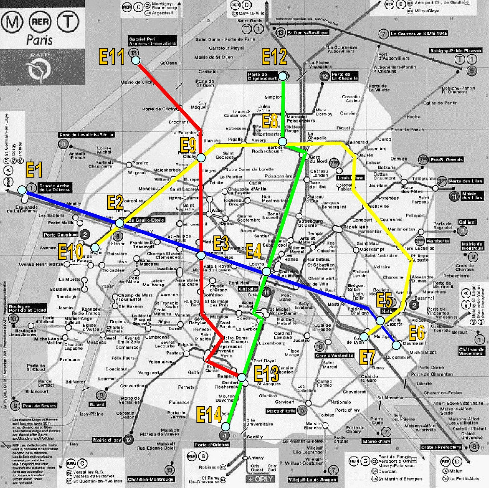

<!-- PROJECT_METADATA
{
  "title": "Paris Metro A* Route Planner",
  "short_description": "Aplicação Rust com interface gráfica que implementa o algoritmo A* para encontrar rotas otimizadas no metrô de Paris usando dados reais.",
  "primary_stack": ["Rust", "egui", "eframe", "CSV"],
  "architecture": "Desktop App",
  "detail_description": "Implementação do algoritmo A* em Rust para roteamento no metrô de Paris com dados reais de distâncias e conexões. O diferencial está na interface gráfica interativa (egui/eframe) que visualiza o processo de busca em tempo real: nós explorados, fronteira atual e caminho final. Suporta 4 linhas de metrô com cálculo de tempo real considerando velocidade dos trens e tempo de baldeação entre linhas. Dados extraídos de tabelas CSV reais com heurística de distância em linha reta.",
  "images": [],
  "cover_image": "",
  "live_url": ""
}
-->

# Paris Metro A* Route Planner

Implementação do algoritmo A* em Rust para encontrar o caminho mais eficiente entre estações do metrô de Paris, com interface gráfica interativa para visualizar o processo de busca.

## O que o Projeto Faz

- **Algoritmo A* completo** — implementação eficiente para grafos de transporte real
- **Visualização em tempo real** — mostra nós explorados, fronteira e decisões do algoritmo
- **Dados reais** — 4 linhas de metrô com distâncias e tempos extraídos de CSVs reais
- **Cálculo temporal** — considera velocidade dos trens e tempo de baldeação entre linhas
- **Interface ajustável** — zoom, navegação e controles interativos

## Stack Técnica

| Camada | Tecnologia |
|--------|-----------|
| Linguagem | Rust |
| Interface Gráfica | egui + eframe |
| Dados | CSV (distâncias reais, conexões, heurísticas) |
| Algoritmo | A* com heurística de distância euclidiana |

## Estrutura

```
src/
├── main.rs                     # Entrypoint
├── algoritmo_a_estrela.rs      # Implementação do A*
├── grafo_metro.rs              # Estrutura de dados do grafo
├── dados_metro.rs              # Carregamento dos dados CSV
└── egui/                       # Módulos de interface gráfica
    ├── app.rs                  # Aplicação principal
    ├── drawing.rs              # Renderização do mapa
    ├── state_manager.rs        # Gerenciamento de estado
    └── visual_effects.rs       # Efeitos visuais da busca

data/
├── tabela1_distancias_diretas.csv    # Heurísticas (linha reta)
├── tabela2_distancias_reais.csv      # Distâncias reais entre estações
└── tabela_linhas_conexao.csv         # Conexões e informações de linha
```

## Como Executar

### Pré-requisitos
- Rust + Cargo instalados ([rustup.rs](https://rustup.rs))

```bash
# Clonar o repositório
git clone https://github.com/Wanjos-eng/rust-paris-transit-a-star.git
cd rust-paris-transit-a-star

# Executar
cargo run --release
```

### Build para distribuição
```bash
cargo build --release
# Binário em: target/release/rust-paris-transit-a-star
```


